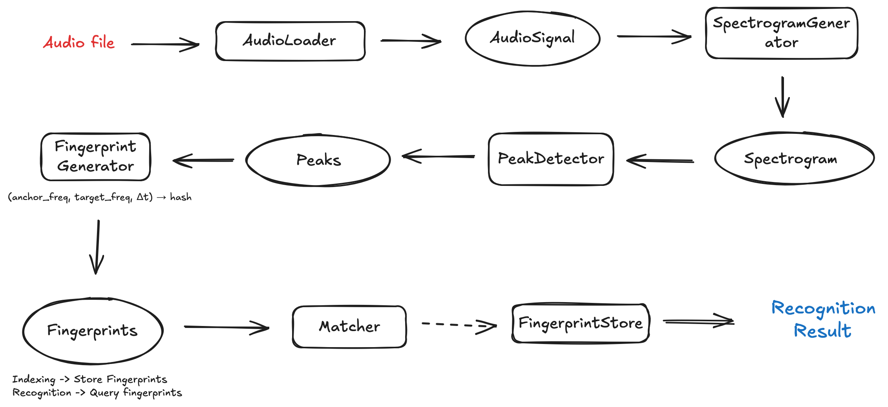
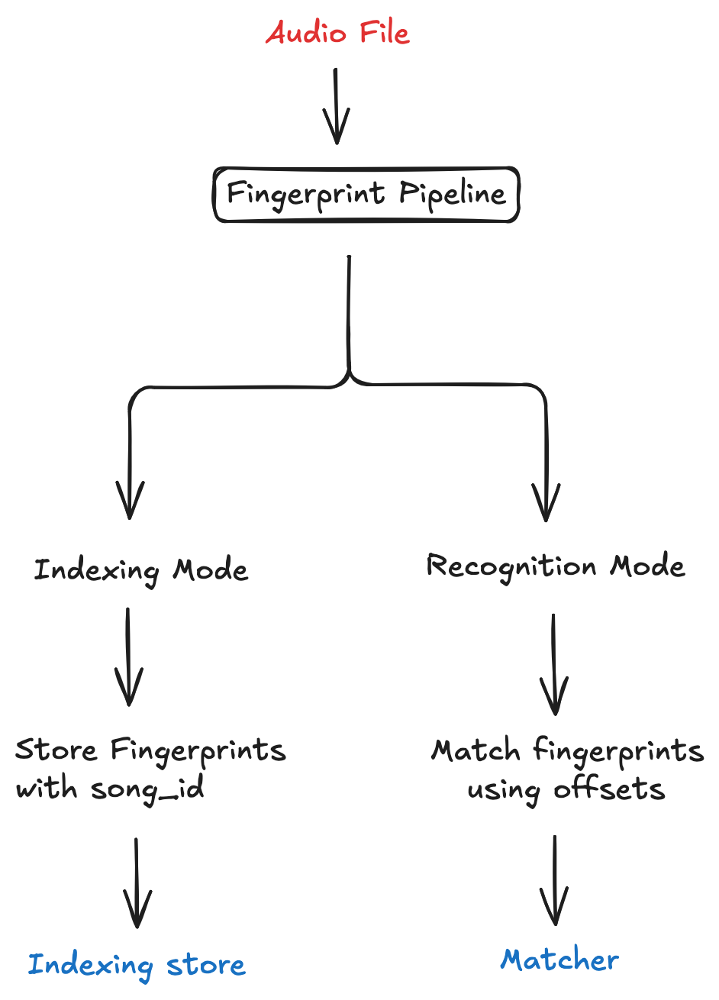
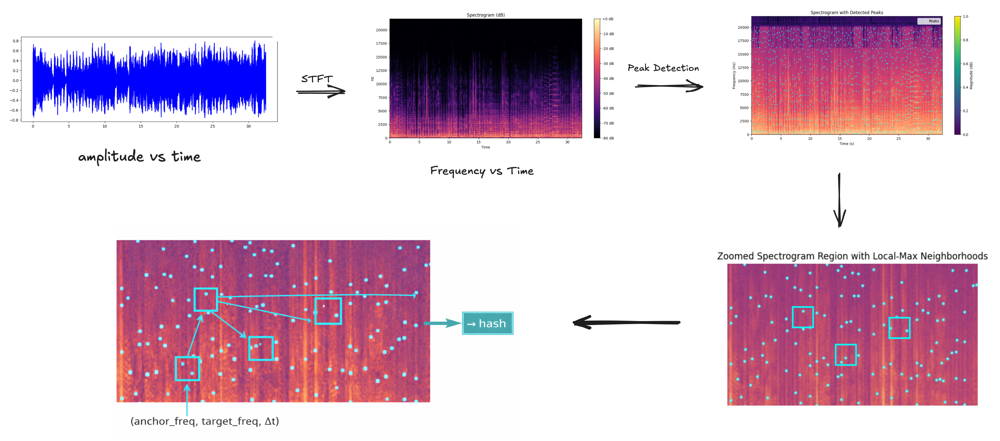

# Kazoom

A from-scratch implementation of an audio fingerprinting and music recognition system, inspired by how apps like Shazam identify songs from short audio clips.

This project focuses on:

    •	understanding how audio fingerprints are constructed
    •	designing a robust matching algorithm
    •	and building a clean, modular backend architecture around it

### Features

    •	Audio fingerprinting using spectral peak pairing
    •	Robust matching via time-offset alignment
    •	SQLite-backed fingerprint database
    •	Separate metadata database for songs
    •	Clean, layered architecture (Audio → Spectrogram → Peaks → Fingerprints → Matching)
    •	Simple frontend + API integration
    •	Designed for single-instance deployment (no distributed assumptions)

## How It Works (High Level)

### Overall Pipeline



1. **Indexing phase**
   - Songs are converted into compact fingerprints
   - Fingerprints are stored in a database

2. **Recognition phase**
   - A short query audio clip is fingerprinted
   - Fingerprints are matched against the database
   - The song with the strongest time-consistent alignment wins

No raw audio is ever compared — only hashes derived from spectral features.

### Indexing vs Recognition



The same fingerprinting pipeline is reused in two modes:

- **Indexing mode** stores fingerprints along with a `song_id`
- **Recognition mode** matches query fingerprints using time-offset alignment

This avoids duplicated logic and keeps the system consistent.

### Getting Started

Prerequisites

    •	Python 3.10+
    •	ffmpeg installed (required by librosa)
    •	SQLite3

### Installation

```
git clone https://github.com/ayushdiagarwal/Kazoom.git
cd Kazoom
pip install -r requirements.txt
python3 backend/app.py # run the backend

# in another terminal tab
cd frontend
python3 -m http.server 3000 # run the frontend on port 3000
```

### Configuration

Edit config.py to set:

    •	sample rate
    •	FFT parameters
    •	fingerprinting thresholds
    •	database paths

All important constants live in one place.

#### Index Songs

python main.py --mode index --path path/to/song.mp3 --song-id 1

This:
• loads the audio
• generates fingerprints
• stores them in the fingerprint database

Song metadata should already exist in the metadata database.

#### Recognize a Song

python main.py --mode recognize --path path/to/query_clip.wav

Returns:

    •	matched song ID
    •	confidence score
    •	associated metadata (title, artist, album)

### Core Algorithm (Detailed)



1. Audio → Spectrogram
   • Audio is converted to mono at a fixed sample rate
   • Short-Time Fourier Transform (STFT) is applied
   • Magnitudes are converted to logarithmic scale (dB)

2. Spectrogram → Peaks
   • Local maxima are detected using a neighborhood filter
   • Only strong peaks above a threshold are kept
   • Each peak is represented as (frequency, time)

These peaks are stable under noise, compression, and distortions.

3. Peaks → Fingerprints
   • Peaks are paired within a time window
   • Each pair generates a fingerprint:

(f_anchor, f_target, Δt)

    •	This tuple is encoded into a single integer hash
    •	Each fingerprint stores:
    •	hash
    •	anchor time
    •	song ID (during indexing)

4. Matching
   • Matching is done using time offset histograms
   • Correct matches show strong alignment at a consistent offset
   • The song with the strongest peak wins
   • Confidence is computed relative to the runner-up

#### Design Philosophy

Some deliberate design decisions:

    •	No global state
    •	Dependency injection over static calls
    •	Domain objects are storage-agnostic
    •	SQLite used intentionally (simple, inspectable, sufficient)
    •	One-way dependencies (lower layers don’t depend on higher ones)

The system is intentionally layered:

    •	low-level signal processing is isolated
    •	domain objects do not depend on storage
    •	services orchestrate workflows without owning logic

#### References & Inspiration

    •	Shazam’s original audio fingerprinting paper
    •	Spectral peak pairing techniques
    •	Time-offset histogram matching methods

### License

This project is licensed under the MIT License.
You’re free to use, modify, and learn from it.

### Final Notes

This project was built as a learning exercise, not a product clone.

The focus was on:

    •	understanding the algorithm deeply
    •	writing clean, maintainable code
    •	and making architectural decisions explicit
